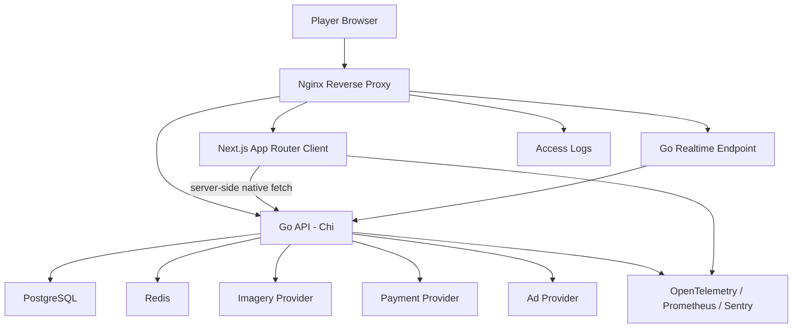
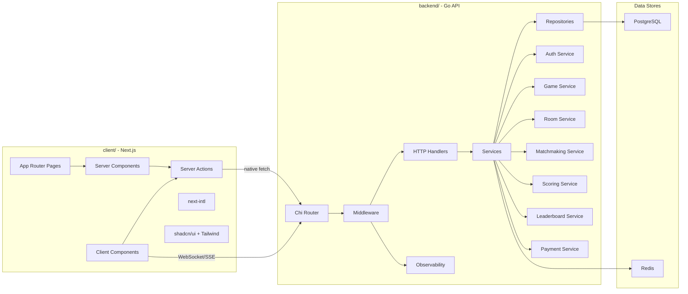
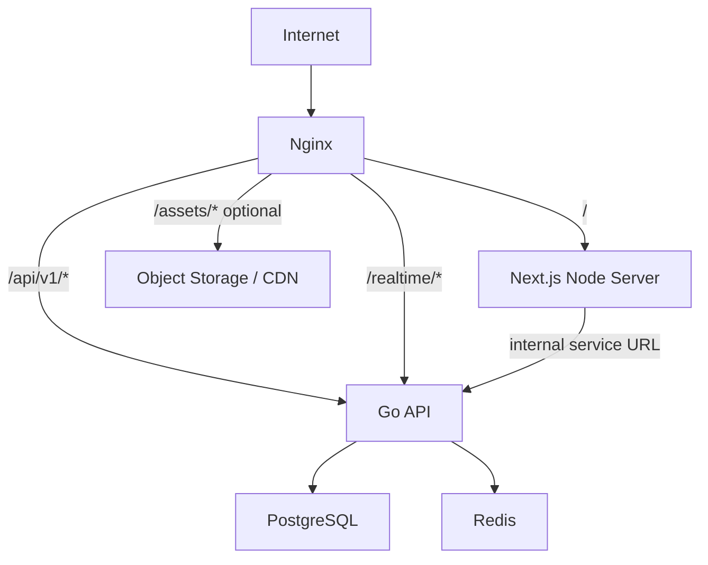
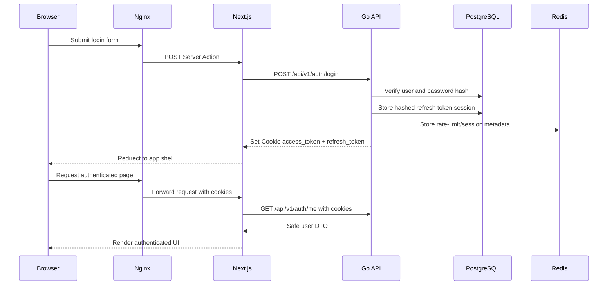
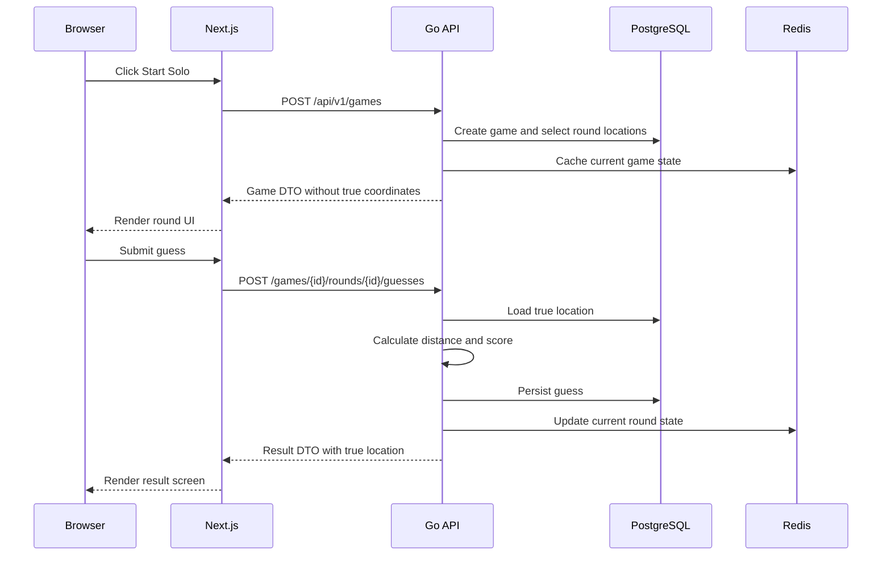
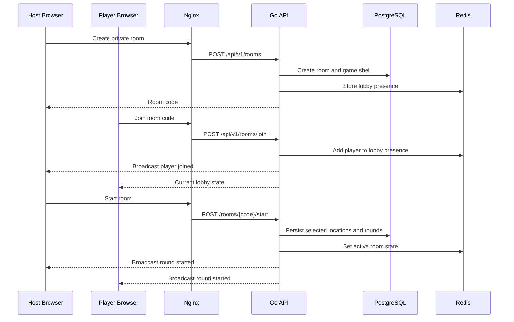
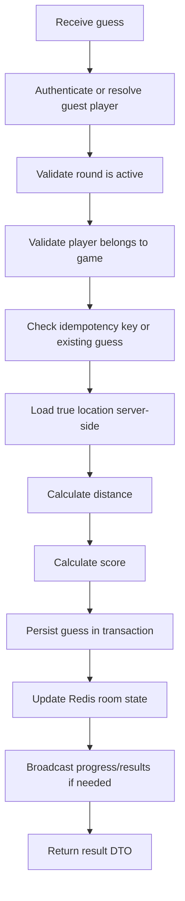

# Phase 2 Diagrams

This file collects the Phase 2 Mermaid diagrams in one place.

## High-Level Architecture

## Component Diagram

## Deployment View

## Authentication Flow

## Solo Game Data Flow

## Multiplayer Room Data Flow

## Guess Submission Flow

