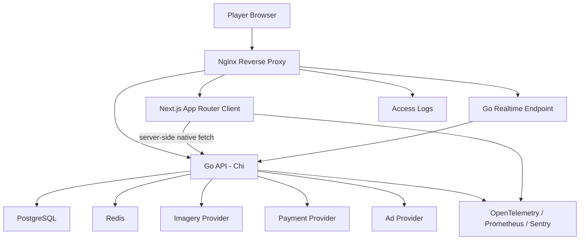
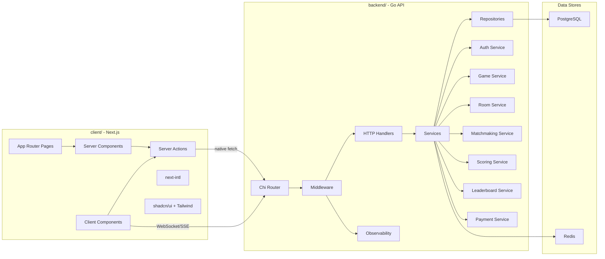
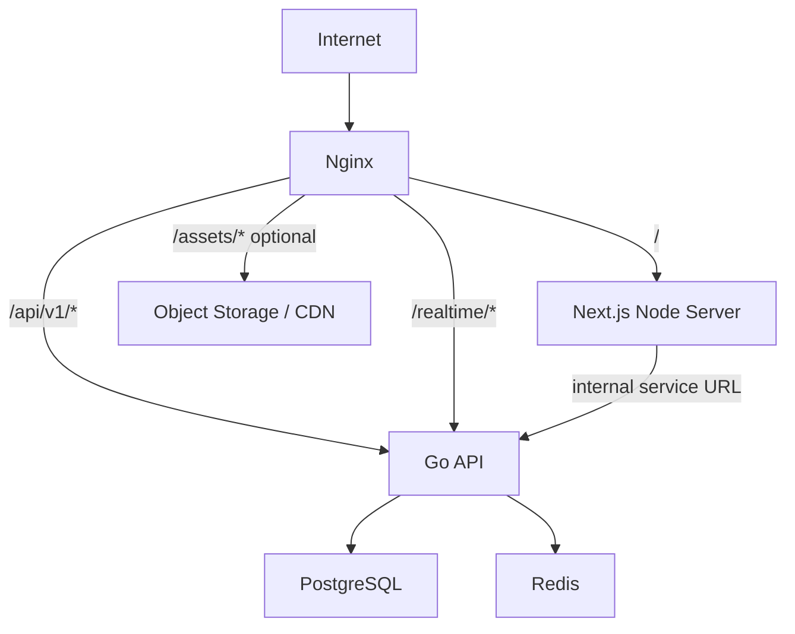
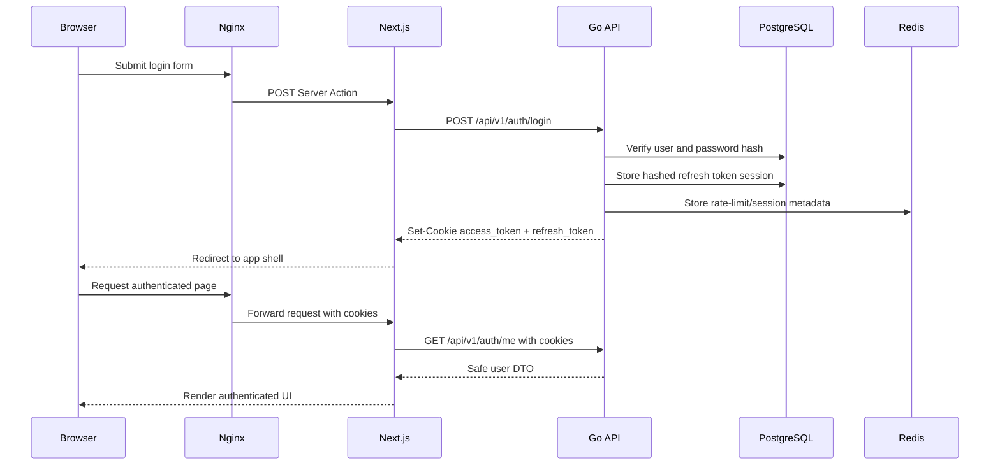
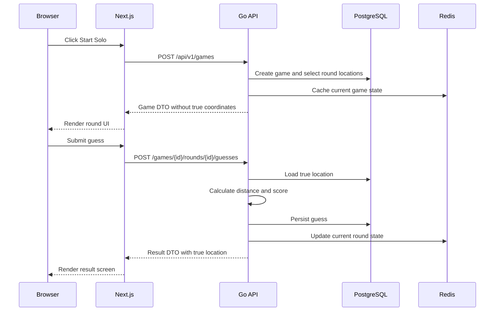
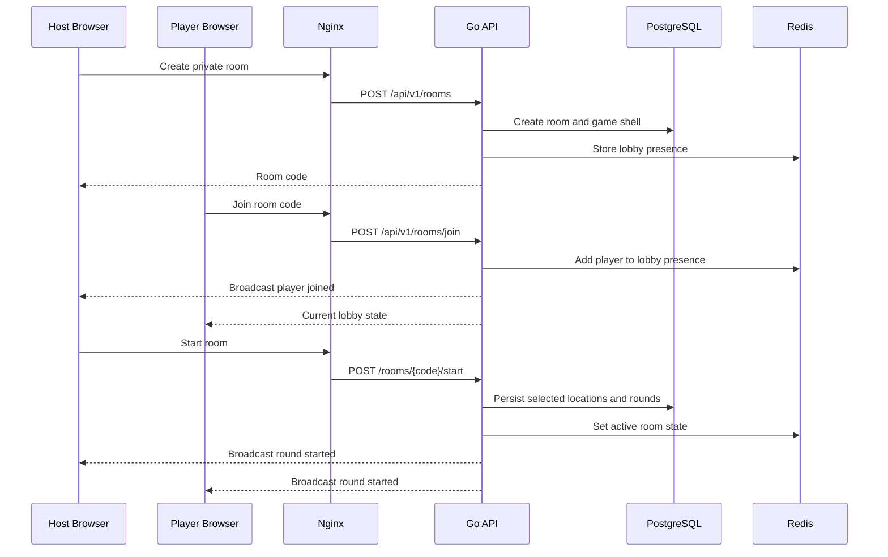
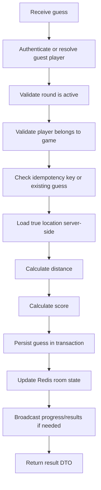

# Phase 2 System Design

## Purpose

This document defines the first production architecture for the GeoGuess-style game. It turns the Phase 1 product definition into system boundaries, request flows, data ownership, and operational decisions.

The design assumes:

- `client/`: Next.js 16+ App Router frontend.
- `backend/`: Go 1.24+ API using Chi.
- Nginx exists in the runtime architecture as the public reverse proxy.
- PostgreSQL is the durable source of truth.
- Redis is used for fast ephemeral multiplayer state, matchmaking, rate limiting, and cache coordination.
- The system starts as a modular monolith, not microservices.

## Architecture Principles

- Keep gameplay authority on the Go API.
- Keep exact coordinates hidden until a guess is locked or a round expires.
- Render stable UI with Next.js Server Components.
- Use Client Components only for map interaction, panorama controls, timers, realtime room state, and other browser-only behavior.
- Use native `fetch()` from Next.js server code to the Go API.
- Use WebSockets or Server-Sent Events for live room updates.
- Store persistent facts in PostgreSQL.
- Store short-lived coordination state in Redis.
- Put Nginx in front of app services for TLS, routing, compression, request limits, static/media routing, and WebSocket proxying.
- Design monetization, ads, and subscriptions as entitlement inputs, not gameplay advantages.

## High-Level Architecture



### Runtime Responsibilities

| Component | Responsibility |
| --- | --- |
| Browser | Runs interactive map, panorama viewer, timers, guess pin placement, realtime room UI. |
| Nginx | TLS termination, reverse proxy, gzip/brotli, rate limits, security headers, static/media routing, WebSocket upgrades. |
| Next.js | Server-rendered UI, routing, localized pages, forms, app shell, Server Actions that call backend services. |
| Go API | Auth, gameplay rules, score calculation, rooms, matchmaking, leaderboards, payments webhooks, admin APIs. |
| PostgreSQL | Durable users, sessions, games, rounds, guesses, locations, subscriptions, payments, leaderboards snapshots. |
| Redis | Matchmaking queues, room presence, realtime fanout coordination, rate limits, cache-aside reads, idempotency keys. |
| Imagery provider | Street-level or static location media. Must follow licensing and attribution rules. |
| Payment provider | Future subscription checkout, billing portal, webhook events. |
| Ad provider | Future free-user ad placements outside active rounds. |
| Observability | Metrics, traces, errors, structured logs, dashboards, alerts. |

## Component Diagram



## Deployment View



### Nginx Routing

| Route | Upstream | Notes |
| --- | --- | --- |
| `/` | Next.js | App Router pages, localized routes, static shell. |
| `/_next/*` | Next.js | Next.js assets. Cache aggressively when safe. |
| `/api/v1/*` | Go API | Public REST API for frontend server, future mobile clients, external consumers. |
| `/realtime/*` | Go API | WebSocket or SSE. Must support connection upgrades. |
| `/health` | Nginx or Go API | Public load balancer health endpoint. |
| `/ready` | Go API | Readiness checks for DB, Redis, and required dependencies. |
| `/metrics` | Go API, restricted | Prometheus scrape endpoint. Do not expose publicly. |

Nginx should enforce body size limits, request timeouts, WebSocket upgrade headers, security headers, and coarse IP-based rate limits before traffic reaches Go.

## API Boundaries

### Browser To Next.js

The browser primarily talks to Next.js pages and Server Actions. This keeps secrets, auth checks, and backend URLs out of the client bundle.

Use browser-to-Go calls only for:

- WebSocket or SSE realtime room updates.
- Public file/media download URLs.
- Future mobile or external client APIs.

### Next.js To Go API

Next.js server code calls the Go API with native `fetch()`.

Examples:

- Server Component loads current user, game summary, leaderboard, and public map lists.
- Server Action creates a solo game, creates a room, joins a room, submits a guess, or starts a room.
- Route Handler only proxies external needs when unavoidable, such as OAuth callbacks if owned by Next.js.

### Go API To Data Stores

Only Go repositories access PostgreSQL and Redis directly. Handlers never access the database. Services own business rules, transactions, idempotency, authorization, scoring, and state transitions.

## REST API Surface

All public API routes should use `/api/v1`.

### Auth

```text
POST   /api/v1/auth/register
POST   /api/v1/auth/login
POST   /api/v1/auth/logout
POST   /api/v1/auth/refresh
GET    /api/v1/auth/me
```

### Games

```text
POST   /api/v1/games
GET    /api/v1/games/{gameId}
POST   /api/v1/games/{gameId}/start
GET    /api/v1/games/{gameId}/rounds/current
POST   /api/v1/games/{gameId}/rounds/{roundId}/guesses
GET    /api/v1/games/{gameId}/results
```

### Rooms

```text
POST   /api/v1/rooms
POST   /api/v1/rooms/join
GET    /api/v1/rooms/{roomCode}
PATCH  /api/v1/rooms/{roomCode}/settings
POST   /api/v1/rooms/{roomCode}/start
DELETE /api/v1/rooms/{roomCode}/players/{playerId}
```

### Matchmaking

```text
POST   /api/v1/matchmaking/queue
DELETE /api/v1/matchmaking/queue
GET    /api/v1/matchmaking/status
```

### Locations And Maps

```text
GET    /api/v1/maps
GET    /api/v1/maps/{mapId}
GET    /api/v1/locations/{locationId}/media
```

Location coordinates must not be returned before a guess is locked or a round expires.

### Leaderboards

```text
GET    /api/v1/leaderboards/daily
GET    /api/v1/leaderboards/maps/{mapId}
GET    /api/v1/users/{userId}/stats
```

### Payments And Entitlements

```text
POST   /api/v1/billing/checkout
POST   /api/v1/billing/portal
GET    /api/v1/billing/entitlements
POST   /api/v1/webhooks/payments
```

Payment webhooks are external-consumer endpoints and belong in the Go API. They must verify provider signatures and use idempotency keys.

## Authentication Flow

Use JWT access tokens and refresh tokens in HTTP-only secure cookies. Do not store tokens in localStorage, Zustand, or client props.



### Cookie Policy

| Cookie | Purpose | Path | Lifetime | Flags |
| --- | --- | --- | --- | --- |
| `access_token` | Short-lived API authentication | `/` | 15 minutes | `HttpOnly`, `Secure`, `SameSite=Lax` |
| `refresh_token` | Session renewal | `/api/v1/auth/refresh` | 30 days | `HttpOnly`, `Secure`, `SameSite=Strict` |
| `csrf_token` | CSRF protection for unsafe methods | `/` | Session | `Secure`, `SameSite=Lax` |

Refresh tokens must be rotated. Store only hashed refresh tokens at rest.

## Solo Game Data Flow



## Multiplayer Room Data Flow



## Guess Submission Flow



## Matchmaking Design

### MVP

Use Redis-backed queues by mode and region:

```text
matchmaking:{mode}:{region}
```

Flow:

1. Player requests quick play.
2. API validates player/session and desired mode.
3. API pushes player into a Redis sorted set with enqueue timestamp.
4. A matchmaking worker scans queues at a fixed interval.
5. Worker creates a public room when enough compatible players are available.
6. If a player waits longer than the timeout, worker creates a smaller room or keeps waiting based on mode rules.

### Why Redis

Matchmaking state is short-lived, frequently updated, and not valuable after expiration. Redis gives cheap queue operations and TTL-based cleanup. PostgreSQL still stores created rooms, games, rounds, and final results.

### Failure Handling

- Queue entries expire.
- Disconnect removes active presence but does not immediately delete the player.
- Room creation must be idempotent to avoid duplicate rooms during worker retries.

## Leaderboards

### MVP

Leaderboards should be derived from completed games and persisted guesses.

Use PostgreSQL for:

- Durable score history.
- Daily challenge rankings.
- User stats.
- Auditable final scores.

Use Redis for:

- Hot leaderboard cache.
- Short-lived sorted sets for current day or active event.

### Update Strategy

1. Guess and game completion are committed to PostgreSQL.
2. Service updates Redis sorted set for hot reads.
3. Periodic job rebuilds leaderboard snapshots from PostgreSQL to correct drift.

This keeps reads fast while preserving correctness.

## Caching Strategy

| Data | Store | Strategy | Invalidation |
| --- | --- | --- | --- |
| Public map list | Next.js cache + Redis | Cache-aside | Tag/path revalidation after admin changes. |
| Location metadata | Redis | Cache-aside | Invalidate on location update. |
| Current room state | Redis | Source for ephemeral state | TTL and explicit cleanup on game end. |
| User session lookup | Redis or PostgreSQL | Token/session metadata cache | Expire with token/session lifetime. |
| Leaderboard hot reads | Redis | Sorted sets/cache-aside | Rebuild from PostgreSQL periodically. |
| Ads entitlement | Redis | Cache-aside | Invalidate on payment webhook. |

Do not cache hidden location coordinates in any client-readable cache.

## Payments And Subscriptions

Payments are future-facing but the architecture reserves clean boundaries.

### Payment Provider Responsibilities

- Checkout session creation.
- Billing portal.
- Subscription lifecycle webhooks.
- Invoice/payment status events.

### Go API Responsibilities

- Verify webhook signatures.
- Store payment events idempotently.
- Update subscription records.
- Produce entitlements such as `ad_free`, `premium_maps`, or `private_room_limit`.

### Gameplay Rule

Subscriptions affect access, limits, ads, and cosmetics. They must not improve scoring, location difficulty fairness, or competitive outcome.

## Ads

Ads should be treated as placements, not gameplay state.

Allowed placements:

- Lobby.
- Between games.
- Final results.
- Non-ranked post-round interstitial only if it does not delay active players unfairly.

Disallowed placements:

- During active timed guessing.
- Over the map in a way that blocks controls.
- In any state that changes score timing or fairness.

The backend should expose entitlement and placement decisions. The client decides rendering, but the server decides whether a user is ad-free.

## Data Ownership

| Domain | Owner | Durable Store | Ephemeral Store |
| --- | --- | --- | --- |
| Users/Auth | Go Auth Service | PostgreSQL | Redis for rate limits/session metadata |
| Locations | Go Location Service | PostgreSQL | Redis for hot metadata |
| Games/Rounds/Guesses | Go Game Service | PostgreSQL | Redis for active state |
| Rooms/Presence | Go Room Service | PostgreSQL for room records | Redis for presence and broadcasts |
| Matchmaking | Go Matchmaking Service | PostgreSQL after room creation | Redis queues |
| Leaderboards | Go Leaderboard Service | PostgreSQL snapshots/history | Redis sorted sets |
| Payments | Go Payment Service | PostgreSQL | Redis idempotency/rate limits |
| Ads/Entitlements | Go Entitlement Service | PostgreSQL | Redis cache |

## Database Boundary

PostgreSQL stores facts:

- User accounts.
- Refresh token sessions.
- Locations and maps.
- Games, rounds, guesses.
- Room records.
- Leaderboard snapshots.
- Payment events and subscription state.
- Audit logs for sensitive actions.

Redis stores coordination:

- Matchmaking queues.
- Active room state.
- Presence heartbeats.
- Realtime fanout.
- Rate limits.
- Idempotency keys.
- Hot leaderboards.
- Cache-aside entries.

## Realtime Boundary

Use WebSockets for multiplayer if bidirectional communication is needed. Use SSE only if the client only receives server events and all writes continue through HTTP.

Recommended MVP:

- HTTP for commands: create room, join room, start game, submit guess.
- WebSocket for events: player joined, player left, round started, guess count changed, round ended, result broadcast.

This keeps writes easy to validate and retry while still giving live multiplayer updates.

## Observability

Every request path should produce:

- Request ID.
- Correlation ID.
- Structured JSON logs.
- OpenTelemetry trace spans.
- Prometheus metrics.
- Sentry errors for unexpected failures.

Core metrics:

- Request duration by route/status.
- Active rooms.
- Active WebSocket connections.
- Matchmaking queue length and wait time.
- Guess submission latency.
- Round start latency.
- Redis and PostgreSQL errors.
- Payment webhook failures.
- Ad decision failures.

## Security Design

- HTTP-only secure cookies for auth tokens.
- CSRF protection for unsafe cookie-authenticated requests.
- Rate limiting at Nginx and Go middleware.
- Validate all request bodies with server-side schemas.
- Authorize every mutation in Go services.
- Never trust guest identities for privileged actions.
- Hide exact coordinates until guess lock or timeout.
- Use signed URLs for private media when needed.
- Verify payment webhook signatures.
- Store refresh tokens hashed at rest.
- Use security headers at Nginx and Next.js.

## Scalability Design

Phase 2 stays modular, but leaves scaling paths open:

- Run multiple stateless Next.js instances.
- Run multiple stateless Go API instances.
- Keep active multiplayer state in Redis so instances can scale horizontally.
- Use Redis pub/sub or streams for realtime fanout across Go instances.
- Use PostgreSQL indexes for game, round, guess, user, and leaderboard queries.
- Use background workers for matchmaking cleanup, leaderboard rebuilds, abandoned room cleanup, email, and payment reconciliation.

## Initial Backend Package Boundaries

```text
backend/
  cmd/api/
  internal/auth/
  internal/users/
  internal/locations/
  internal/games/
  internal/rooms/
  internal/matchmaking/
  internal/leaderboards/
  internal/payments/
  internal/ads/
  internal/middleware/
  internal/platform/postgres/
  internal/platform/redis/
  internal/platform/observability/
  migrations/
  openapi/
```

## Initial Frontend Feature Boundaries

```text
client/
  app/[locale]/
    (public)/
    (game)/
    (auth)/
  features/auth/
  features/game/
  features/rooms/
  features/matchmaking/
  features/leaderboards/
  features/billing/
  features/ads/
  lib/api/
  lib/auth/
  lib/i18n/
  components/ui/
  messages/
```

## Open Questions

- Which imagery provider is legal and affordable for MVP?
- Should MVP multiplayer use WebSocket immediately, or start with polling/SSE for lower complexity?
- Will guests be allowed to create rooms, or only authenticated users?
- Is public quick play part of MVP or Phase 3?
- Which payment provider will be used later?
- Will ads be required at launch or introduced after retention is proven?
- Is Nginx deployed in front of both Next.js and Go in production, or only in local/self-hosted environments?

## Phase 2 Exit Criteria

Phase 2 is complete when:

- High-level architecture is accepted.
- Nginx routing responsibilities are agreed.
- API boundaries are clear.
- Auth and refresh-token flow are accepted.
- Solo and multiplayer data flows are understood.
- Redis and PostgreSQL responsibilities are separated.
- Payments, ads, leaderboards, matchmaking, and caching have documented system boundaries.
- Phase 3 can define database schema, API contracts, and implementation milestones.
