# Phase 3 Database Design

## Purpose

This document defines the PostgreSQL data model for the GeoGuess-style game before writing migrations. It covers the ERD, schema draft, relationships, constraints, and index strategy.

No migrations should be created until this model is reviewed and stable.

## Design Principles

- PostgreSQL is the durable source of truth.
- Redis owns ephemeral coordination state such as presence, matchmaking queues, active room snapshots, and rate limits.
- Use UUID primary keys for all application tables.
- Use explicit foreign keys and constraints.
- Keep exact location coordinates in the database, but never expose them through APIs before guess lock or round timeout.
- Model guest gameplay without forcing account creation.
- Avoid soft deletes by default. Use status fields or explicit archival where product/legal requirements justify it.
- Use bounded list queries and cursor pagination for growing tables.
- Use SQL migrations with Goose later. Do not use GORM AutoMigrate in production.

## Key Modeling Decision

Registered accounts and game participants are separate concepts.

- `users` represents a registered account.
- `game_players` represents a participant in one game.
- A `game_players` row may point to a registered `user_id` or a guest identity hash.

This supports free guest play now while keeping room for profiles, friends, leaderboards, achievements, subscriptions, and saved stats later.

## Full ERD

```mermaid
erDiagram
  users ||--o{ user_profiles : has
  users ||--o{ auth_sessions : owns
  users ||--o{ friendships : requester
  users ||--o{ friendships : addressee
  users ||--o{ games : creates
  users ||--o{ game_players : participates_as_account
  users ||--o{ rooms : hosts
  users ||--o{ subscriptions : owns
  users ||--o{ payments : makes
  users ||--o{ user_achievements : earns
  users ||--o{ leaderboard_entries : appears_on
  users ||--o{ audit_logs : actor

  maps ||--o{ map_locations : contains
  locations ||--o{ map_locations : belongs_to
  maps ||--o{ games : selected_for
  locations ||--o{ rounds : used_in

  games ||--o{ rounds : has
  games ||--o{ game_players : has
  games ||--o{ rooms : backed_by
  games ||--o{ matches : backed_by
  games ||--o{ leaderboard_entries : scored_by

  rounds ||--o{ guesses : receives
  game_players ||--o{ guesses : submits

  rooms ||--o{ room_players : has
  game_players ||--o{ room_players : joins_room_as

  matches ||--o{ match_players : has
  game_players ||--o{ match_players : joins_match_as

  leaderboards ||--o{ leaderboard_entries : has
  subscriptions ||--o{ payments : paid_by
  subscriptions ||--o{ user_entitlements : grants
  achievements ||--o{ user_achievements : awarded_as

  users {
    uuid id PK
    citext email UK
    text password_hash
    text role
    text status
    timestamptz email_verified_at
    timestamptz last_login_at
    timestamptz created_at
    timestamptz updated_at
  }

  user_profiles {
    uuid user_id PK,FK
    text display_name
    text avatar_url
    text country_code
    text locale
    text timezone
    timestamptz created_at
    timestamptz updated_at
  }

  auth_sessions {
    uuid id PK
    uuid user_id FK
    text refresh_token_hash UK
    text user_agent_hash
    inet ip_address
    timestamptz expires_at
    timestamptz revoked_at
    timestamptz created_at
    timestamptz last_used_at
  }

  friendships {
    uuid id PK
    uuid user_a_id FK
    uuid user_b_id FK
    uuid requested_by_user_id FK
    text status
    timestamptz accepted_at
    timestamptz created_at
    timestamptz updated_at
  }

  maps {
    uuid id PK
    text slug UK
    text name
    text description
    text visibility
    text access_tier
    text difficulty
    text status
    uuid created_by_user_id FK
    timestamptz created_at
    timestamptz updated_at
  }

  locations {
    uuid id PK
    numeric latitude
    numeric longitude
    text country_code
    text region
    text locality
    text difficulty
    text provider
    text provider_ref
    text attribution
    text status
    numeric random_key
    timestamptz created_at
    timestamptz updated_at
  }

  map_locations {
    uuid map_id PK,FK
    uuid location_id PK,FK
    int selection_weight
    timestamptz created_at
  }

  games {
    uuid id PK
    text mode
    text status
    uuid map_id FK
    uuid created_by_user_id FK
    int round_count
    int timer_seconds
    int scoring_version
    int total_score
    timestamptz started_at
    timestamptz completed_at
    timestamptz created_at
    timestamptz updated_at
  }

  rounds {
    uuid id PK
    uuid game_id FK
    uuid location_id FK
    int round_number
    text status
    timestamptz starts_at
    timestamptz ends_at
    timestamptz revealed_at
    timestamptz created_at
  }

  game_players {
    uuid id PK
    uuid game_id FK
    uuid user_id FK
    text guest_identity_hash
    text display_name
    text role
    text status
    int total_score
    timestamptz joined_at
    timestamptz left_at
  }

  guesses {
    uuid id PK
    uuid round_id FK
    uuid game_player_id FK
    numeric latitude
    numeric longitude
    int distance_meters
    int score
    text idempotency_key
    timestamptz submitted_at
    timestamptz created_at
  }

  rooms {
    uuid id PK
    uuid game_id FK
    text code UK
    text visibility
    text status
    uuid host_user_id FK
    int max_players
    int round_count
    int timer_seconds
    timestamptz expires_at
    timestamptz created_at
    timestamptz updated_at
  }

  room_players {
    uuid room_id PK,FK
    uuid game_player_id PK,FK
    text status
    timestamptz joined_at
    timestamptz left_at
  }

  matches {
    uuid id PK
    uuid game_id FK
    text mode
    text region
    text status
    int min_players
    int max_players
    timestamptz queued_at
    timestamptz matched_at
    timestamptz created_at
  }

  match_players {
    uuid match_id PK,FK
    uuid game_player_id PK,FK
    timestamptz joined_at
  }

  leaderboards {
    uuid id PK
    text kind
    text scope_type
    uuid scope_id
    timestamptz period_start
    timestamptz period_end
    timestamptz created_at
  }

  leaderboard_entries {
    uuid id PK
    uuid leaderboard_id FK
    uuid user_id FK
    uuid game_id FK
    int rank
    int score
    int games_played
    timestamptz recorded_at
  }

  subscriptions {
    uuid id PK
    uuid user_id FK
    text provider
    text provider_subscription_id UK
    text plan_code
    text status
    timestamptz current_period_start
    timestamptz current_period_end
    bool cancel_at_period_end
    timestamptz created_at
    timestamptz updated_at
  }

  user_entitlements {
    uuid id PK
    uuid user_id FK
    uuid subscription_id FK
    text entitlement_key
    timestamptz starts_at
    timestamptz expires_at
    timestamptz created_at
  }

  payments {
    uuid id PK
    uuid user_id FK
    uuid subscription_id FK
    text provider
    text provider_payment_id UK
    int amount_cents
    text currency
    text status
    timestamptz paid_at
    timestamptz created_at
  }

  achievements {
    uuid id PK
    text code UK
    text name
    text description
    jsonb criteria
    bool is_active
    timestamptz created_at
    timestamptz updated_at
  }

  user_achievements {
    uuid user_id PK,FK
    uuid achievement_id PK,FK
    uuid game_id FK
    timestamptz earned_at
  }

  audit_logs {
    uuid id PK
    uuid actor_user_id FK
    text action
    text target_type
    uuid target_id
    jsonb metadata
    timestamptz created_at
  }
```

## Migration Priority

### MVP Schema

Create these first when the ERD is approved:

- `users`
- `user_profiles`
- `auth_sessions`
- `maps`
- `locations`
- `map_locations`
- `games`
- `rounds`
- `game_players`
- `guesses`
- `rooms`
- `room_players`

### Phase 2 Gameplay Expansion

- `matches`
- `match_players`
- `leaderboards`
- `leaderboard_entries`
- `friendships`
- `achievements`
- `user_achievements`

### Monetization Expansion

- `subscriptions`
- `user_entitlements`
- `payments`
- payment webhook event table, if the provider requires durable event replay

### Operations And Security

- `audit_logs`
- optional durable `idempotency_keys` table for payment-like writes

## Schema Draft

This is a logical schema, not a Goose migration.

### users

Registered user accounts.

| Column | Type | Required | Notes |
| --- | --- | --- | --- |
| `id` | `uuid` | yes | Primary key, generated by PostgreSQL. |
| `email` | `citext` | yes | Unique, case-insensitive. |
| `password_hash` | `text` | yes | Argon2id or bcrypt hash. Never store plaintext. |
| `role` | `text` | yes | `user`, `admin`, `moderator`. |
| `status` | `text` | yes | `active`, `disabled`, `pending_verification`, `deleted`. |
| `email_verified_at` | `timestamptz` | no | Null until verified. |
| `last_login_at` | `timestamptz` | no | Updated after successful login. |
| `created_at` | `timestamptz` | yes | Defaults to `now()`. |
| `updated_at` | `timestamptz` | yes | Updated by application or trigger. |

Constraints:

- Unique `email`.
- `role` check constraint.
- `status` check constraint.

### user_profiles

Public profile fields. Kept separate from auth credentials to avoid leaking account internals.

| Column | Type | Required | Notes |
| --- | --- | --- | --- |
| `user_id` | `uuid` | yes | Primary key and FK to `users.id`. |
| `display_name` | `text` | yes | Public display name. |
| `avatar_url` | `text` | no | External or signed media URL. |
| `country_code` | `text` | no | ISO country code for display/stats. |
| `locale` | `text` | yes | Example: `en`, `ar`. |
| `timezone` | `text` | no | IANA timezone. |
| `created_at` | `timestamptz` | yes | Defaults to `now()`. |
| `updated_at` | `timestamptz` | yes | Updated by application or trigger. |

Constraints:

- `display_name` length between 2 and 32.
- `country_code` length is 2 when present.

### auth_sessions

Refresh token session records. Access JWTs are short-lived and not stored.

| Column | Type | Required | Notes |
| --- | --- | --- | --- |
| `id` | `uuid` | yes | Primary key. |
| `user_id` | `uuid` | yes | FK to `users.id`. |
| `refresh_token_hash` | `text` | yes | Unique hash of refresh token. |
| `user_agent_hash` | `text` | no | Hashed user agent for session display/risk checks. |
| `ip_address` | `inet` | no | Last known IP. Consider privacy retention. |
| `expires_at` | `timestamptz` | yes | Session expiration. |
| `revoked_at` | `timestamptz` | no | Set on logout, rotation failure, or security event. |
| `created_at` | `timestamptz` | yes | Defaults to `now()`. |
| `last_used_at` | `timestamptz` | no | Updated on refresh. |

Constraints:

- Unique `refresh_token_hash`.
- `expires_at > created_at`.

### friendships

Symmetric friend relationship between two registered users.

| Column | Type | Required | Notes |
| --- | --- | --- | --- |
| `id` | `uuid` | yes | Primary key. |
| `user_a_id` | `uuid` | yes | Lower sorted user UUID, FK to `users.id`. |
| `user_b_id` | `uuid` | yes | Higher sorted user UUID, FK to `users.id`. |
| `requested_by_user_id` | `uuid` | yes | FK to requesting user. |
| `status` | `text` | yes | `pending`, `accepted`, `blocked`, `declined`. |
| `accepted_at` | `timestamptz` | no | Set when accepted. |
| `created_at` | `timestamptz` | yes | Defaults to `now()`. |
| `updated_at` | `timestamptz` | yes | Updated by application or trigger. |

Constraints:

- `user_a_id <> user_b_id`.
- Unique `(user_a_id, user_b_id)`.
- `requested_by_user_id IN (user_a_id, user_b_id)` enforced by application or trigger.

### maps

Playable location pools, such as world, country packs, daily challenge pools, or future premium packs.

| Column | Type | Required | Notes |
| --- | --- | --- | --- |
| `id` | `uuid` | yes | Primary key. |
| `slug` | `text` | yes | Unique stable route/API identifier. |
| `name` | `text` | yes | Admin-facing default name. User-facing localized names can come later. |
| `description` | `text` | no | Optional. |
| `visibility` | `text` | yes | `public`, `private`, `unlisted`. |
| `access_tier` | `text` | yes | `free`, `premium`, `admin`. |
| `difficulty` | `text` | yes | `mixed`, `easy`, `medium`, `hard`. |
| `status` | `text` | yes | `draft`, `active`, `archived`. |
| `created_by_user_id` | `uuid` | no | FK to admin/creator user. |
| `created_at` | `timestamptz` | yes | Defaults to `now()`. |
| `updated_at` | `timestamptz` | yes | Updated by application or trigger. |

Constraints:

- Unique `slug`.
- Check constraints for `visibility`, `access_tier`, `difficulty`, and `status`.

### locations

Curated playable location records.

| Column | Type | Required | Notes |
| --- | --- | --- | --- |
| `id` | `uuid` | yes | Primary key. |
| `latitude` | `numeric(9,6)` | yes | True latitude. Hidden until result reveal. |
| `longitude` | `numeric(9,6)` | yes | True longitude. Hidden until result reveal. |
| `country_code` | `text` | yes | ISO country code. |
| `region` | `text` | no | State, province, or region. |
| `locality` | `text` | no | City/town/locality. |
| `difficulty` | `text` | yes | `easy`, `medium`, `hard`, `expert`. |
| `provider` | `text` | yes | Imagery provider name. |
| `provider_ref` | `text` | yes | Provider media or panorama ID. |
| `attribution` | `text` | no | Required provider attribution. |
| `status` | `text` | yes | `active`, `disabled`, `needs_review`. |
| `random_key` | `numeric` | yes | Precomputed random value for indexed random selection. |
| `created_at` | `timestamptz` | yes | Defaults to `now()`. |
| `updated_at` | `timestamptz` | yes | Updated by application or trigger. |

Constraints:

- `latitude BETWEEN -90 AND 90`.
- `longitude BETWEEN -180 AND 180`.
- Unique `(provider, provider_ref)`.
- Check constraints for `difficulty` and `status`.

Note: do not use `ORDER BY random()` at scale. Use `random_key`, map membership, filters, and indexed range selection.

### map_locations

Join table between maps and locations.

| Column | Type | Required | Notes |
| --- | --- | --- | --- |
| `map_id` | `uuid` | yes | FK to `maps.id`. |
| `location_id` | `uuid` | yes | FK to `locations.id`. |
| `selection_weight` | `int` | yes | Defaults to `1`. |
| `created_at` | `timestamptz` | yes | Defaults to `now()`. |

Constraints:

- Primary key `(map_id, location_id)`.
- `selection_weight > 0`.

### games

A full game session. Solo, private room, quick play, and future ranked modes all produce games.

| Column | Type | Required | Notes |
| --- | --- | --- | --- |
| `id` | `uuid` | yes | Primary key. |
| `mode` | `text` | yes | `solo`, `private_room`, `quick_play`, `daily`, `ranked`. |
| `status` | `text` | yes | `pending`, `active`, `completed`, `abandoned`, `cancelled`. |
| `map_id` | `uuid` | yes | FK to `maps.id`. |
| `created_by_user_id` | `uuid` | no | FK to registered creator. Null for guests/system. |
| `round_count` | `int` | yes | Defaults to `5`. |
| `timer_seconds` | `int` | no | Null means untimed. |
| `scoring_version` | `int` | yes | Locks scoring formula for historical games. |
| `total_score` | `int` | yes | Aggregate score for solo or system summary. |
| `started_at` | `timestamptz` | no | Set when game starts. |
| `completed_at` | `timestamptz` | no | Set when game ends. |
| `created_at` | `timestamptz` | yes | Defaults to `now()`. |
| `updated_at` | `timestamptz` | yes | Updated by application or trigger. |

Constraints:

- `round_count BETWEEN 1 AND 10` for MVP.
- `timer_seconds IS NULL OR timer_seconds BETWEEN 10 AND 600`.
- `total_score >= 0`.
- Check constraints for `mode` and `status`.

### rounds

One location inside one game.

| Column | Type | Required | Notes |
| --- | --- | --- | --- |
| `id` | `uuid` | yes | Primary key. |
| `game_id` | `uuid` | yes | FK to `games.id`. |
| `location_id` | `uuid` | yes | FK to `locations.id`. Hidden from client before reveal. |
| `round_number` | `int` | yes | 1-based round number. |
| `status` | `text` | yes | `pending`, `active`, `completed`, `cancelled`. |
| `starts_at` | `timestamptz` | no | Set when round starts. |
| `ends_at` | `timestamptz` | no | Timer expiration or manual completion. |
| `revealed_at` | `timestamptz` | no | Set when true location can be shown. |
| `created_at` | `timestamptz` | yes | Defaults to `now()`. |

Constraints:

- Unique `(game_id, round_number)`.
- `round_number > 0`.
- Check constraint for `status`.

### game_players

Participants in a game. Supports registered and guest players.

| Column | Type | Required | Notes |
| --- | --- | --- | --- |
| `id` | `uuid` | yes | Primary key. |
| `game_id` | `uuid` | yes | FK to `games.id`. |
| `user_id` | `uuid` | no | FK to `users.id` for registered players. |
| `guest_identity_hash` | `text` | no | Hash of guest session identity. |
| `display_name` | `text` | yes | Snapshot used for results. |
| `role` | `text` | yes | `host`, `player`, `spectator`. |
| `status` | `text` | yes | `active`, `disconnected`, `left`, `kicked`. |
| `total_score` | `int` | yes | Aggregate score across rounds. |
| `joined_at` | `timestamptz` | yes | Defaults to `now()`. |
| `left_at` | `timestamptz` | no | Set when player leaves. |

Constraints:

- At least one of `user_id` or `guest_identity_hash` must be present.
- Unique registered player per game: partial unique `(game_id, user_id)` where `user_id IS NOT NULL`.
- Unique guest player per game: partial unique `(game_id, guest_identity_hash)` where `guest_identity_hash IS NOT NULL`.
- `total_score >= 0`.

### guesses

One submitted guess for one player in one round.

| Column | Type | Required | Notes |
| --- | --- | --- | --- |
| `id` | `uuid` | yes | Primary key. |
| `round_id` | `uuid` | yes | FK to `rounds.id`. |
| `game_player_id` | `uuid` | yes | FK to `game_players.id`. |
| `latitude` | `numeric(9,6)` | yes | Player guess latitude. |
| `longitude` | `numeric(9,6)` | yes | Player guess longitude. |
| `distance_meters` | `int` | yes | Calculated server-side. |
| `score` | `int` | yes | Calculated server-side. |
| `idempotency_key` | `text` | no | Client retry key for safe resubmission. |
| `submitted_at` | `timestamptz` | yes | Server timestamp. |
| `created_at` | `timestamptz` | yes | Defaults to `now()`. |

Constraints:

- Unique `(round_id, game_player_id)`.
- Optional unique `(game_player_id, idempotency_key)` where `idempotency_key IS NOT NULL`.
- `latitude BETWEEN -90 AND 90`.
- `longitude BETWEEN -180 AND 180`.
- `distance_meters >= 0`.
- `score BETWEEN 0 AND 5000`.

### rooms

Private or public lobby state persisted for audit/history. Active presence stays in Redis.

| Column | Type | Required | Notes |
| --- | --- | --- | --- |
| `id` | `uuid` | yes | Primary key. |
| `game_id` | `uuid` | no | Unique FK to `games.id` after game creation/start. |
| `code` | `text` | yes | Short uppercase join code. |
| `visibility` | `text` | yes | `private`, `public`. |
| `status` | `text` | yes | `lobby`, `active`, `completed`, `expired`, `cancelled`. |
| `host_user_id` | `uuid` | no | FK to `users.id`. Null if guest hosts are allowed. |
| `max_players` | `int` | yes | Defaults to `8`. |
| `round_count` | `int` | yes | Defaults to `5`. |
| `timer_seconds` | `int` | no | Null means untimed. |
| `expires_at` | `timestamptz` | yes | Cleanup boundary. |
| `created_at` | `timestamptz` | yes | Defaults to `now()`. |
| `updated_at` | `timestamptz` | yes | Updated by application or trigger. |

Constraints:

- Unique `code` for active room codes. Prefer partial unique index on active statuses.
- `max_players BETWEEN 2 AND 50`.
- `round_count BETWEEN 1 AND 10`.
- Check constraints for `visibility` and `status`.

### room_players

Room membership history linked to a game participant.

| Column | Type | Required | Notes |
| --- | --- | --- | --- |
| `room_id` | `uuid` | yes | FK to `rooms.id`. |
| `game_player_id` | `uuid` | yes | FK to `game_players.id`. |
| `status` | `text` | yes | `joined`, `left`, `kicked`, `disconnected`. |
| `joined_at` | `timestamptz` | yes | Defaults to `now()`. |
| `left_at` | `timestamptz` | no | Set when no longer active. |

Constraints:

- Primary key `(room_id, game_player_id)`.
- Check constraint for `status`.

### matches

Public matchmaking result. Matchmaking queue state itself lives in Redis.

| Column | Type | Required | Notes |
| --- | --- | --- | --- |
| `id` | `uuid` | yes | Primary key. |
| `game_id` | `uuid` | no | Unique FK to `games.id` after game creation. |
| `mode` | `text` | yes | `quick_play`, `ranked`, future modes. |
| `region` | `text` | no | Matchmaking region. |
| `status` | `text` | yes | `forming`, `matched`, `active`, `completed`, `cancelled`. |
| `min_players` | `int` | yes | Default `2`. |
| `max_players` | `int` | yes | Default `8`. |
| `queued_at` | `timestamptz` | yes | First player enqueue time. |
| `matched_at` | `timestamptz` | no | Set when match is formed. |
| `created_at` | `timestamptz` | yes | Defaults to `now()`. |

Constraints:

- `min_players >= 1`.
- `max_players >= min_players`.
- Check constraints for `mode` and `status`.

### match_players

Participants assigned to a public match.

| Column | Type | Required | Notes |
| --- | --- | --- | --- |
| `match_id` | `uuid` | yes | FK to `matches.id`. |
| `game_player_id` | `uuid` | yes | FK to `game_players.id`. |
| `joined_at` | `timestamptz` | yes | Defaults to `now()`. |

Constraints:

- Primary key `(match_id, game_player_id)`.

### leaderboards

Leaderboard definitions and periods.

| Column | Type | Required | Notes |
| --- | --- | --- | --- |
| `id` | `uuid` | yes | Primary key. |
| `kind` | `text` | yes | `daily`, `map`, `global`, `ranked`. |
| `scope_type` | `text` | yes | `global`, `map`, `daily_challenge`. |
| `scope_id` | `uuid` | no | Optional map/challenge ID. |
| `period_start` | `timestamptz` | no | Null for all-time. |
| `period_end` | `timestamptz` | no | Null for all-time/open period. |
| `created_at` | `timestamptz` | yes | Defaults to `now()`. |

Constraints:

- Check constraints for `kind` and `scope_type`.
- Unique `(kind, scope_type, scope_id, period_start)`.

### leaderboard_entries

Materialized leaderboard rows for fast reads. Redis can mirror hot leaderboards.

| Column | Type | Required | Notes |
| --- | --- | --- | --- |
| `id` | `uuid` | yes | Primary key. |
| `leaderboard_id` | `uuid` | yes | FK to `leaderboards.id`. |
| `user_id` | `uuid` | yes | FK to `users.id`. Global leaderboards require registered users. |
| `game_id` | `uuid` | no | FK to best/scoring game. |
| `rank` | `int` | no | Computed rank. |
| `score` | `int` | yes | Leaderboard score. |
| `games_played` | `int` | yes | Count used for aggregate leaderboards. |
| `recorded_at` | `timestamptz` | yes | Defaults to `now()`. |

Constraints:

- Unique `(leaderboard_id, user_id)`.
- `score >= 0`.
- `games_played >= 0`.
- `rank IS NULL OR rank > 0`.

### subscriptions

Provider subscription state. Future feature, not MVP-critical.

| Column | Type | Required | Notes |
| --- | --- | --- | --- |
| `id` | `uuid` | yes | Primary key. |
| `user_id` | `uuid` | yes | FK to `users.id`. |
| `provider` | `text` | yes | Example: `stripe`. |
| `provider_subscription_id` | `text` | yes | Unique provider ID. |
| `plan_code` | `text` | yes | Internal plan key. |
| `status` | `text` | yes | `trialing`, `active`, `past_due`, `cancelled`, `expired`. |
| `current_period_start` | `timestamptz` | no | Provider period start. |
| `current_period_end` | `timestamptz` | no | Provider period end. |
| `cancel_at_period_end` | `boolean` | yes | Defaults to false. |
| `created_at` | `timestamptz` | yes | Defaults to `now()`. |
| `updated_at` | `timestamptz` | yes | Updated by webhook/application. |

Constraints:

- Unique `(provider, provider_subscription_id)`.
- Check constraint for `status`.

### user_entitlements

Feature access derived from subscriptions, grants, promotions, or admin overrides.

| Column | Type | Required | Notes |
| --- | --- | --- | --- |
| `id` | `uuid` | yes | Primary key. |
| `user_id` | `uuid` | yes | FK to `users.id`. |
| `subscription_id` | `uuid` | no | FK to `subscriptions.id`. Null for admin/promo grants. |
| `entitlement_key` | `text` | yes | Example: `ad_free`, `premium_maps`. |
| `starts_at` | `timestamptz` | yes | Start time. |
| `expires_at` | `timestamptz` | no | Null means no scheduled expiration. |
| `created_at` | `timestamptz` | yes | Defaults to `now()`. |

Constraints:

- Unique active entitlement should be enforced by service logic or partial index if needed.
- `expires_at IS NULL OR expires_at > starts_at`.

### payments

Payment records. Do not store raw card data.

| Column | Type | Required | Notes |
| --- | --- | --- | --- |
| `id` | `uuid` | yes | Primary key. |
| `user_id` | `uuid` | yes | FK to `users.id`. |
| `subscription_id` | `uuid` | no | FK to `subscriptions.id`. |
| `provider` | `text` | yes | Example: `stripe`. |
| `provider_payment_id` | `text` | yes | Unique provider payment intent/invoice ID. |
| `amount_cents` | `int` | yes | Minor currency unit. |
| `currency` | `text` | yes | ISO 4217 lowercase. |
| `status` | `text` | yes | `pending`, `succeeded`, `failed`, `refunded`. |
| `paid_at` | `timestamptz` | no | Set when settled. |
| `created_at` | `timestamptz` | yes | Defaults to `now()`. |

Constraints:

- Unique `(provider, provider_payment_id)`.
- `amount_cents >= 0`.
- `char_length(currency) = 3`.
- Check constraint for `status`.

### achievements

Achievement definitions.

| Column | Type | Required | Notes |
| --- | --- | --- | --- |
| `id` | `uuid` | yes | Primary key. |
| `code` | `text` | yes | Unique stable achievement code. |
| `name` | `text` | yes | Admin/default name. Localized copy can live in app messages. |
| `description` | `text` | yes | Admin/default description. |
| `criteria` | `jsonb` | yes | Machine-readable criteria definition. |
| `is_active` | `boolean` | yes | Defaults to true. |
| `created_at` | `timestamptz` | yes | Defaults to `now()`. |
| `updated_at` | `timestamptz` | yes | Updated by application or trigger. |

Constraints:

- Unique `code`.

### user_achievements

Awarded achievements.

| Column | Type | Required | Notes |
| --- | --- | --- | --- |
| `user_id` | `uuid` | yes | FK to `users.id`. |
| `achievement_id` | `uuid` | yes | FK to `achievements.id`. |
| `game_id` | `uuid` | no | FK to game that caused the award. |
| `earned_at` | `timestamptz` | yes | Defaults to `now()`. |

Constraints:

- Primary key `(user_id, achievement_id)`.

### audit_logs

Security and admin audit trail.

| Column | Type | Required | Notes |
| --- | --- | --- | --- |
| `id` | `uuid` | yes | Primary key. |
| `actor_user_id` | `uuid` | no | FK to `users.id`; null for system/provider events. |
| `action` | `text` | yes | Example: `location.disabled`, `auth.login_failed`. |
| `target_type` | `text` | yes | Example: `location`, `user`, `payment`. |
| `target_id` | `uuid` | no | Target resource ID when available. |
| `metadata` | `jsonb` | yes | Redacted structured metadata. |
| `created_at` | `timestamptz` | yes | Defaults to `now()`. |

Constraints:

- Metadata must not contain raw passwords, tokens, secrets, or full payment data.

## Relationship Rules

- A `user` can have one `user_profile`.
- A `user` can have many `auth_sessions`.
- A `user` can participate in many games through `game_players`.
- A `game` has many `rounds`.
- A `game` has many `game_players`.
- A `round` belongs to exactly one `location`.
- A `game_player` can submit at most one `guess` per `round`.
- A `map` contains many `locations` through `map_locations`.
- A `room` can produce one `game`.
- A `match` can produce one `game`.
- `rooms` are durable room records; active presence lives in Redis.
- `matches` are durable matchmaking outcomes; active queues live in Redis.
- Global leaderboards include registered `users`, not anonymous guests.
- `subscriptions` and `payments` never affect scoring rules.

## Index Strategy

### Global Rules

- Every foreign key used in joins should have an index.
- Every list endpoint needs an index matching its filters and sort order.
- Every uniqueness rule should be backed by a unique constraint or unique index.
- Use cursor pagination for growing tables such as `games`, `guesses`, `leaderboard_entries`, and `audit_logs`.
- Prefer partial indexes for active records where historical rows grow large.
- Do not add indexes speculatively. Each index should map to a real query.

### Core Indexes

| Table | Index | Purpose |
| --- | --- | --- |
| `users` | unique `users_email_key(email)` | Login and account uniqueness. |
| `users` | `(created_at DESC, id DESC)` | Admin/user list cursor pagination. |
| `auth_sessions` | `(user_id, expires_at DESC)` | Session management. |
| `auth_sessions` | unique `(refresh_token_hash)` | Refresh token lookup and rotation. |
| `friendships` | unique `(user_a_id, user_b_id)` | Prevent duplicate friendships. |
| `friendships` | `(user_a_id, status)` and `(user_b_id, status)` | Friend list lookups. |
| `maps` | unique `(slug)` | Public map route/API lookup. |
| `maps` | `(status, visibility, access_tier)` | Public map listing. |
| `locations` | unique `(provider, provider_ref)` | Prevent duplicate provider imports. |
| `locations` | `(status, country_code, difficulty, random_key)` | Location selection. |
| `map_locations` | primary `(map_id, location_id)` | Map membership. |
| `map_locations` | `(location_id)` | Location reverse lookup. |
| `games` | `(created_by_user_id, created_at DESC, id DESC)` | User history. |
| `games` | `(status, created_at DESC)` | Cleanup/admin jobs. |
| `rounds` | unique `(game_id, round_number)` | Round lookup and ordering. |
| `rounds` | `(location_id)` | Location usage analysis. |
| `game_players` | `(game_id, status)` | Game roster lookup. |
| `game_players` | partial unique `(game_id, user_id)` where `user_id IS NOT NULL` | One registered participant per game. |
| `game_players` | partial unique `(game_id, guest_identity_hash)` where `guest_identity_hash IS NOT NULL` | One guest participant per game. |
| `guesses` | unique `(round_id, game_player_id)` | One guess per player per round. |
| `guesses` | `(game_player_id, submitted_at DESC)` | Player history/stats. |
| `guesses` | `(round_id, submitted_at)` | Round result aggregation. |
| `rooms` | partial unique `(code)` where `status IN ('lobby', 'active')` | Active room join codes. |
| `rooms` | `(host_user_id, created_at DESC)` | Host room history. |
| `rooms` | `(status, expires_at)` | Cleanup jobs. |
| `room_players` | primary `(room_id, game_player_id)` | Room membership. |
| `matches` | `(mode, region, status, created_at)` | Match history/admin lookups. |
| `match_players` | primary `(match_id, game_player_id)` | Match membership. |
| `leaderboards` | unique `(kind, scope_type, scope_id, period_start)` | Leaderboard identity. |
| `leaderboard_entries` | unique `(leaderboard_id, user_id)` | One row per user per leaderboard. |
| `leaderboard_entries` | `(leaderboard_id, score DESC, recorded_at ASC)` | Ranking reads. |
| `subscriptions` | unique `(provider, provider_subscription_id)` | Webhook reconciliation. |
| `subscriptions` | `(user_id, status)` | Entitlement reads. |
| `user_entitlements` | `(user_id, entitlement_key, starts_at, expires_at)` | Access checks. |
| `payments` | unique `(provider, provider_payment_id)` | Idempotent provider events. |
| `payments` | `(user_id, created_at DESC)` | Billing history. |
| `achievements` | unique `(code)` | Award lookup. |
| `user_achievements` | primary `(user_id, achievement_id)` | Prevent duplicate awards. |
| `audit_logs` | `(created_at DESC, id DESC)` | Audit review pagination. |
| `audit_logs` | `(actor_user_id, created_at DESC)` | User audit history. |

## Constraint Strategy

### Use Database Constraints For

- Primary keys.
- Foreign keys.
- Unique identity rules.
- Enum-like status checks.
- Numeric ranges such as lat/lng, score, distance, timer, round count.
- One-guess-per-round rules.
- Active room code uniqueness.

### Use Service-Level Validation For

- Whether a player can submit before timeout.
- Whether a user is allowed to host a room.
- Whether a map requires premium entitlement.
- Whether a location can be used in a selected map.
- Whether a leaderboard entry should be accepted.
- Payment provider signature verification.

### Why Both Exist

Service validation gives good errors and domain behavior. Database constraints protect the system from race conditions, bugs, retries, and future code paths that forget a rule.

## Transaction Boundaries

Use transactions for:

- Creating a game with rounds and initial participants.
- Starting a private room and attaching a game.
- Submitting a guess and updating player/game totals.
- Completing a game and writing leaderboard candidates.
- Accepting a friend request.
- Processing payment webhooks and updating subscriptions/entitlements.
- Awarding achievements after game completion.

Avoid broad read-only transactions unless a consistency requirement is clear.

## Data Integrity Notes

- Score and distance are stored on `guesses` so historical scores remain stable if formulas change.
- `games.scoring_version` records which scoring formula was used.
- `game_players.display_name` snapshots the player name at time of play.
- `rounds.location_id` is sensitive before reveal, but it remains a normal FK internally.
- Guest identity hashes must be generated from secure guest session identifiers, never from raw IP alone.
- Payment tables store provider IDs and amounts, never raw card data.

## Redis Boundary

Keep these out of PostgreSQL unless audit/history is required:

- WebSocket presence.
- Current active room snapshot.
- Matchmaking queue entries.
- Rate limit counters.
- Short-lived idempotency keys for non-payment writes.
- Hot leaderboard sorted sets.
- Cache-aside entries for maps/location metadata.

Persist these in PostgreSQL:

- Final games, rounds, and guesses.
- Durable room/match records.
- Payment events and subscription state.
- Audit logs.
- Leaderboard snapshots.

## Security Considerations

- Store password hashes using Argon2id or bcrypt.
- Store refresh token hashes, not raw refresh tokens.
- Do not expose `locations.latitude` or `locations.longitude` before reveal.
- Use least-privilege database roles for app runtime and migrations.
- Redact audit metadata.
- Do not store secrets, cookies, JWTs, or payment card data in logs or JSONB metadata.
- Consider encryption-at-rest at the infrastructure layer.
- Keep admin location import routes protected and audited.

## Performance Considerations

- Avoid `ORDER BY random()` for location selection.
- Use indexed cursor pagination on large tables.
- Keep hot multiplayer state in Redis, not repeated PostgreSQL polling.
- Use batched queries for game result screens to avoid N+1 lookups.
- Use `EXPLAIN ANALYZE` for leaderboard, user history, and location selection queries.
- Consider table partitioning later for `guesses`, `audit_logs`, and payment events if they grow quickly.
- Use connection pooling and request-scoped timeouts in the Go API.

## Open Questions

- Will guest users be allowed to create private rooms, or only join them?
- Should global leaderboards include guests, or only registered users?
- Which imagery provider determines the exact media metadata columns?
- Do we need PostGIS later for radius search, map balancing, or admin tooling?
- Do we need localized map/location names in the database, or should they stay in app messages initially?
- Should room codes be globally unique forever or reusable after expiration?
- Which payment provider will define webhook and payment event fields?

## Phase 3 Exit Criteria

Phase 3 is ready for migrations when:

- The ERD is approved.
- MVP tables are selected.
- Guest versus registered player behavior is approved.
- Leaderboard eligibility is approved.
- Room and match relationships are approved.
- Location provider metadata requirements are known.
- Indexes match expected API query patterns.
- Constraints are accepted by product and backend.
- Migration order is agreed.
