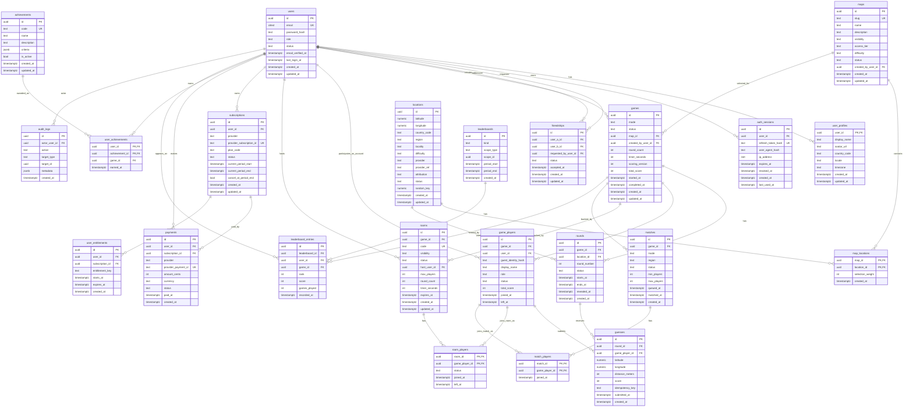

# Phase 3 ERD

```mermaid
erDiagram
  users ||--o{ user_profiles : has
  users ||--o{ auth_sessions : owns
  users ||--o{ friendships : requester
  users ||--o{ friendships : addressee
  users ||--o{ games : creates
  users ||--o{ game_players : participates_as_account
  users ||--o{ rooms : hosts
  users ||--o{ subscriptions : owns
  users ||--o{ payments : makes
  users ||--o{ user_achievements : earns
  users ||--o{ leaderboard_entries : appears_on
  users ||--o{ audit_logs : actor

  maps ||--o{ map_locations : contains
  locations ||--o{ map_locations : belongs_to
  maps ||--o{ games : selected_for
  locations ||--o{ rounds : used_in

  games ||--o{ rounds : has
  games ||--o{ game_players : has
  games ||--o{ rooms : backed_by
  games ||--o{ matches : backed_by
  games ||--o{ leaderboard_entries : scored_by

  rounds ||--o{ guesses : receives
  game_players ||--o{ guesses : submits

  rooms ||--o{ room_players : has
  game_players ||--o{ room_players : joins_room_as

  matches ||--o{ match_players : has
  game_players ||--o{ match_players : joins_match_as

  leaderboards ||--o{ leaderboard_entries : has
  subscriptions ||--o{ payments : paid_by
  subscriptions ||--o{ user_entitlements : grants
  achievements ||--o{ user_achievements : awarded_as

  users {
    uuid id PK
    citext email UK
    text password_hash
    text role
    text status
    timestamptz email_verified_at
    timestamptz last_login_at
    timestamptz created_at
    timestamptz updated_at
  }

  user_profiles {
    uuid user_id PK,FK
    text display_name
    text avatar_url
    text country_code
    text locale
    text timezone
    timestamptz created_at
    timestamptz updated_at
  }

  auth_sessions {
    uuid id PK
    uuid user_id FK
    text refresh_token_hash UK
    text user_agent_hash
    inet ip_address
    timestamptz expires_at
    timestamptz revoked_at
    timestamptz created_at
    timestamptz last_used_at
  }

  friendships {
    uuid id PK
    uuid user_a_id FK
    uuid user_b_id FK
    uuid requested_by_user_id FK
    text status
    timestamptz accepted_at
    timestamptz created_at
    timestamptz updated_at
  }

  maps {
    uuid id PK
    text slug UK
    text name
    text description
    text visibility
    text access_tier
    text difficulty
    text status
    uuid created_by_user_id FK
    timestamptz created_at
    timestamptz updated_at
  }

  locations {
    uuid id PK
    numeric latitude
    numeric longitude
    text country_code
    text region
    text locality
    text difficulty
    text provider
    text provider_ref
    text attribution
    text status
    numeric random_key
    timestamptz created_at
    timestamptz updated_at
  }

  map_locations {
    uuid map_id PK,FK
    uuid location_id PK,FK
    int selection_weight
    timestamptz created_at
  }

  games {
    uuid id PK
    text mode
    text status
    uuid map_id FK
    uuid created_by_user_id FK
    int round_count
    int timer_seconds
    int scoring_version
    int total_score
    timestamptz started_at
    timestamptz completed_at
    timestamptz created_at
    timestamptz updated_at
  }

  rounds {
    uuid id PK
    uuid game_id FK
    uuid location_id FK
    int round_number
    text status
    timestamptz starts_at
    timestamptz ends_at
    timestamptz revealed_at
    timestamptz created_at
  }

  game_players {
    uuid id PK
    uuid game_id FK
    uuid user_id FK
    text guest_identity_hash
    text display_name
    text role
    text status
    int total_score
    timestamptz joined_at
    timestamptz left_at
  }

  guesses {
    uuid id PK
    uuid round_id FK
    uuid game_player_id FK
    numeric latitude
    numeric longitude
    int distance_meters
    int score
    text idempotency_key
    timestamptz submitted_at
    timestamptz created_at
  }

  rooms {
    uuid id PK
    uuid game_id FK
    text code UK
    text visibility
    text status
    uuid host_user_id FK
    int max_players
    int round_count
    int timer_seconds
    timestamptz expires_at
    timestamptz created_at
    timestamptz updated_at
  }

  room_players {
    uuid room_id PK,FK
    uuid game_player_id PK,FK
    text status
    timestamptz joined_at
    timestamptz left_at
  }

  matches {
    uuid id PK
    uuid game_id FK
    text mode
    text region
    text status
    int min_players
    int max_players
    timestamptz queued_at
    timestamptz matched_at
    timestamptz created_at
  }

  match_players {
    uuid match_id PK,FK
    uuid game_player_id PK,FK
    timestamptz joined_at
  }

  leaderboards {
    uuid id PK
    text kind
    text scope_type
    uuid scope_id
    timestamptz period_start
    timestamptz period_end
    timestamptz created_at
  }

  leaderboard_entries {
    uuid id PK
    uuid leaderboard_id FK
    uuid user_id FK
    uuid game_id FK
    int rank
    int score
    int games_played
    timestamptz recorded_at
  }

  subscriptions {
    uuid id PK
    uuid user_id FK
    text provider
    text provider_subscription_id UK
    text plan_code
    text status
    timestamptz current_period_start
    timestamptz current_period_end
    bool cancel_at_period_end
    timestamptz created_at
    timestamptz updated_at
  }

  user_entitlements {
    uuid id PK
    uuid user_id FK
    uuid subscription_id FK
    text entitlement_key
    timestamptz starts_at
    timestamptz expires_at
    timestamptz created_at
  }

  payments {
    uuid id PK
    uuid user_id FK
    uuid subscription_id FK
    text provider
    text provider_payment_id UK
    int amount_cents
    text currency
    text status
    timestamptz paid_at
    timestamptz created_at
  }

  achievements {
    uuid id PK
    text code UK
    text name
    text description
    jsonb criteria
    bool is_active
    timestamptz created_at
    timestamptz updated_at
  }

  user_achievements {
    uuid user_id PK,FK
    uuid achievement_id PK,FK
    uuid game_id FK
    timestamptz earned_at
  }

  audit_logs {
    uuid id PK
    uuid actor_user_id FK
    text action
    text target_type
    uuid target_id
    jsonb metadata
    timestamptz created_at
  }
```
